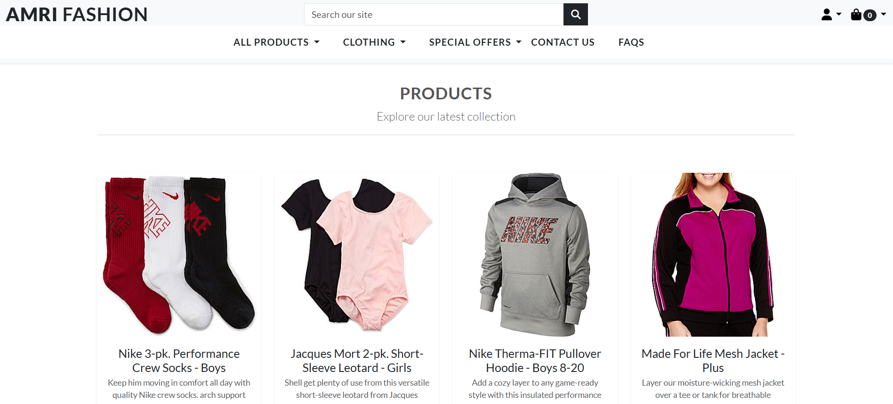

# [AMRI FASHION](https://amri-fashion-aa5dd1ef8dac.herokuapp.com/)

 

Amri Fashion is a modern e-commerce platform designed to provide stylish, high-quality, and affordable fashion for everyone. The platform offers a seamless shopping experience with features like product sorting, filtering, a shopping cart, and secure checkout.

---


## Features

### User Features

**User Registration**
- Users can register for an account using a front-end form. This creates a user object in the database and automatically secures the user's sensitive information.

**User Login**
- Users who have made an account can quickly and easily log in to their account in order to access the login-required functionality of the site.

**User Logout**
- Users who are logged in can easily log out in order to stop access to their account-based information and functionality.

**User Password Recovery**
- Users who have forgotten their password can recover their password via the forgot password link on the login page. Users will enter their email and get a password reset link sent to their account email which they can use to set a new password.

**Toasts**
- Users see helpful popup messages when performing actions on the site. These messages inform the user of the success or failure of their actions, as well as providing information about an action taken, or steps that the user must take in order to correct an action.

**Basket Updates**
- Via toasts, users can see a summary of their basket whenever an item is added, allowing the user to quickly see the new state of their basket, without having to navigate away from the page they are currently on.


**Login Dependant Navbar Links**
- Users who are logged in see new links in the navbar. 'Register' and 'Login' links are replaced with 'My Account' links. This provides the user with visual feedback upon logging in, as well as removing links that they will not need.


**Login Redirect**
- Users who are not logged in who attempt to access an area of the site which requires login are redirected to the login page. After logging in, they are sent to the page they first intended to visit.


**User Profile Creation**
- User profiles are automatically created upon user registration. This assigns each user a profile which they can use to see/update their user information.


**User Profile Update**
- Users can update their profile information using a front-end form located on their user profile page. This allows users to update profile information or correct possible mistakes made at registration.


**User Contact**
- Users can use a front-end form to message the site owners. The form is easy to use and pre-fills the user's email address if they are logged in. Users get confirmation that their message was sent, and a message that someone from the site will be in touch as soon as possible


**User Email Confirmations**
- After making a purchase or subscribing to the newsletter, the site automatically sends the user a confirmation email which contains their purchase details, or in the case of newsletter subscription, a thank you message and a link to unsubscribe.


**product Search**
- Users can use a front-end dropdown to enter search criteria for the purposes of searching for products to purchase. This allows users to instantly find products related to their search keywords, allowing them to navigate straight to the relevant products.


**Newsletter Subscribe**
- Users can use a button in the footer of all site pages to subscribe to the site newsletter. If the user is logged in, the email input field will pre-fill with the user's email. Users see a confirmation screen after subscribing, and receive a confirmation email to the address they provided.


### Admin Features

- **Create Products**
- Administrators can use a front-end form to create new site products. The form is simple and clean and automatically formats and displays the created product in the same manner as existing products.


- **Edit Products**
- Administrators can use a front-end form to update existing products. If the current logged-in user has superuser privileges, an edit button will appear under products which allows that user to edit the product's details.


- **Delete Products**
- Administrators can use a front-end form to delete existing products. If the current logged-in user has superuser privileges, a delete button will appear under posts which allows that user to delete that product.


- **Webhooks**
- The site uses a secure and robust webhook system to ensure that the payment process cannot be interrupted and corrupted, either through user error or malicious intent. Webhooks are incorporated via the Stripe payment system and are handled on the Stripe website, by way of the python code in `checkout > webhook_handler.py` and `checkout > webhooks.py`


- **Contact Requests**
- Admins can see a list of all of the contact messages sent by users. Messages are displayed in an easy-to-read table, with all of the salient information presented. Messages are automatically sorted with those messages which have not been responded to at the top of the list, with the oldest (the message which has gone unanswered the longest) at the top. Admins can click on the view details links to see the full contact messages, as well as respond to the message.


- **Contact Details**
- Admins can see details of a contact message left by the user. All of the contact message's information can be seen, including email, name, subject, message, and whether this contact message has been respond to. Contact messages can be responded to or deleted via the large buttons at the bottom of the page. A link navigates back to the contact requests page.


- **Contact Message Delete**
- Admins can delete contact messages from the database using a front end delete function inside the contact message details page.

- **Contact Respond**
- Admins can respond to user contact messages using an email form which appears upon clicking the 'respond to message' button on the contact details page. A text area appears with the user's name and the default email signoff link pre-populated for efficiency in the typing of the response. The 'Send Email' button sends an email response to the user's given email address with the content of the text box as the body of the email.


## UX

- The design philosophy was to create a fun, engaging look, while keeping relevant information presented in a salient and clean manner, allowing the user to easily and pleasingly navigate through the site.

### Colour Scheme

- I used [coolors.co](https://coolors.co/2c6967-f8ddd0-e67e7c-ed8500-000000-ffffff) to generate my colour palette.


### Typography

- [Lato](https://fonts.google.com/specimen/Lato) was used for the primary headers and titles and text.

- [Font Awesome](https://fontawesome.com) icons were used throughout the site.

## Technologies Used

### Backend
- **Python**: Core programming language.
- **Django**: Web framework for building the backend.
- **PostgreSQL**: Database for storing product, user, and order data.

### Frontend
- **HTML5**: Structure of the web pages.
- **CSS3**: Styling for the platform.
- **Bootstrap 5**: Responsive design and UI components.
- **JavaScript**: Interactive features like dynamic cart updates.

### Other Tools
- **Stripe**: Payment gateway for secure transactions.
- **AWS S3**: Storage for static and media files.
- **Gunicorn**: WSGI HTTP server for deployment.
- **Heroku**: Hosting platform for deployment.


## Database Design

While planning this project, I wrote textual representation of the Entity-Relationship Diagram an Entity Relationship Diagram (ERD) for Amri Fashion, which outlines the key entities, their attributes, and relationships.

### Entities and Relationships:

#### 1. User
| **Attributes:** | Type |
| --- | --- |
| id |  Primary Key |
|  email | EmailField |
|  password | PasswordField |
|  is_superuser  | BooleanField |
|  date_joined | DateAndTimeField | 

**Relationships:**
- A user can place multiple orders.
- A user can save multiple delivery addresses.


#### 2. Product
| **Attributes:** | Type |
| --- | --- |
| id |  Primary Key |
| category | FK to Category |
| sku | CharField |
| name | CharField |
| description | TextField |
| price | DecimalField |
| rating | DecimalField |
| image_url | URLField |
| image | ImageField |

**Relationships:**
- A product belongs to one category.
- A product can appear in multiple orders.


#### 3. Category
| **Attributes:** | Type |
| --- | --- |
| id |  Primary Key |
| name | Charfield |
| friendly_name | Charfield |

**Relationships:**
- A category can have multiple products.


4. ### Order
| **Attributes:** | Type |
| --- | --- |
| id |  Primary Key |
| order_number | Charfield |
| user_profile | Foreign Key to UserProfile |
| full_name | Charfield|
| email |EmailField|
| phone_number | IntigerField
| county | Charfield|
| postcode |Charfield|
| town_or_city |Charfield|
| street_address1 |Charfield|
| street_address1 |Charfield|
| country |Charfield|
| date |dateandtime|
| grand_total | DecimalField|
| original_bag | DecimalField|
| stripe_pid |Charfield|

**Relationships:**
- An order belongs to one user.
- An order contains multiple order items.


5. ### OrderLineItem
| **Attributes:** | Type |
| --- | --- |
| id | Primary Key |
| order | Foreign Key to Order | 
| product | Foreign Key to Product |
| quantity | IntegerField |
| product_size | CharField |
| lineitem_total | DecimalField |

**Relationships:**
- An order item belongs to one order.
- An order item references one product.


#### 6. Contact
| **Attributes:** | Type |
| --- | --- |
| id | Primary Key |
| name | CharField |
| email | EmailField |
| Subject | CharField |
| message | TextField |
| date_created | TextField |
| responded | BooleanField |

**Relationships:**
- A contact message may belong to a user.
#### 7. FAQ
| **Attributes:** | Type |
| --- | --- |
| id | Primary Key |
| question | Charfield |
| answer | Charfield |

**Relationships:**
- FAQs are standalone and do not have direct relationships with other entities.


## User Stories

All user stories can be found in a linked GitHub project [here](https://github.com/users/MAbuhanif/projects/10)

### Site Pages

**Homepage**

- The main homepage for the site.Large heading tells users they are in the right place. Call to Shop Now button to invite users to enter and explore the site products.


**Products Page**

    - Products page. Displays the site products available for the user to purchase. Displays images of products and their essential information including title, description, price, category & level. products are displayed in a pleasing responsive grid layout, making it easy for a user to browse the products. 



- **About Page**

    - About page. Gives users essential information about Amri Fashion Website.  


- **FAQ Page**

    - FAQ Page. Displays the most frequently asked questions about the site. Lets users know essential information and quells worries that they may have about the site and its products. accordion serve to make the information engaging and clean.


- **Contact Page**

    - Contact Page. Users can contact the site owner using the contact form. If the user is logged in, their email is pre-filled in the email input field. Users can choose from a selection of subjects and leave their message via the text box. 


- **Contact Success Page**

    - Contact Success Page. Users see this page after sending a contact message via the contact page. This page serves to confirm to the user that their message has been sent successfully. A short message informs the user that their contact message has been received, and that one of the team will respond as soon as possible.


- **Contact Requests Page - Admin Only**

    - Contact Requests Page. Admins can see a list of all of the contact messages sent by users. Messages are displayed in an easy-to-read table, with all of the salient information presented. Messages are automatically sorted with those messages which have not been responded to at the top of the list, with the oldest (the message which has gone unanswered the longest) at the top. Admins can click on the view details links to see the full contact messages, as well as respond to the message.


- **Contact Details Page - Admin Only**

    - Contact Details Page. Admins can see details of a contact message left by the user. All of the contact message's information can be seen, including email, name, subject, message, and whether this contact message has been respond to. Contact messages can be responded to or deleted via the large buttons at the bottom of the page. A link navigates back to the contact requests page.


- **Contact Delete Page - Delete - Admin Only**

    - Contact Message Delete Page. An admin sees this page after clicking the delete message button on the Contact Details Page. This page double checks that deletion of the contact message is the intended course of action and allows an admin to either confirm the action or return to the contact message's detail page.


- **Signup Page**

    - Signup Page. Displays a signup form that new users can use to register an account on the site. Simple input fields for email, username and password make it easy for users to sign up for an account.


- **Login Page**

    - Login Page. Displays a login form that existing users can use to log in to the site. Two simple input fields for username and password make it easy for users to log in to their account. 


- **Profile Page**

    - Profile page. Displays a user's profile information. Lets a user see their relevant profile information in a clean and simple way, and contains an update form that users can use to update their profile information. Users can also see their order history, with full details of their order as well as links to see past order confirmations.


- **Shopping bag Page**

    - Shopping bag page. Displays all items currently in the user's shopping bag. Users get a message if their basket is empty, otherwise they will see a list of products that they have selected with a button to navigate to the products page, and another to navigate to the checkout page.


- **Checkout Page**

    - Checkout page. Displays an order summary of the items that are being prepared for purchase with accompanying item details. Displays a total cost of the order to the user. The user also sees a form to fill in their personal details. For logged in users, these details will be pre-filled if the user has provided that information in the past.


- **Checkout Success Page**

    - Checkout Success Page. Displays a thank you message to the user, as well as a message describing how to access their purchased products. Also displays an order summary with all the relevant information, including a unique order number.


- **Add Product Page - Admin Only**

    - Add Product Page. Admins can use this form to add new products to the site. User-friendly form inputs allow product objects to be created simply and quickly.


- **Edit Product Page - Admin Only**

    - Edit Product Page. Admins can use this form to add edit products to the site. User-friendly form inputs allow product objects to be edited simply and quickly. A message at the top of the page informs the admin which product they are editing.


- **Custom Error Pages**

    - 404 Custom error handler page provide a more user-friendly error page and includes an informative message and button to return home to the site. 


## Agile Development Process

### GitHub Projects

[GitHub Projects](https://github.com/users/MAbuhanif/projects/10) served as an Agile tool for this project.
It isn't a specialized tool, but with the right tags and project creation/issue assignments, it can be made to work.

Through it, user stories, issues and tasks were planned, then tracked on a weekly basis using the basic Kanban board.

The MoSCoW method was used with accompanying custom Github project labels to help me to prioritise the important tasks in the time I had available.

Epics were decomposed into smaller User Stories, which were themselves further broken down into Tasks. The Github issue linking system was utilised to ensure that user stories which were children of an epic were kept organised and easily accessible through these links


## E-commerce Business Model

**Amri Fashion** is a **B2C (Business to Consumer)** e-commerce platform that sells trendy, affordable fashion directly to individual customers through an online store.

### Business Intent
- Provide a seamless and enjoyable online shopping experience.
- Make stylish, high-quality fashion accessible at affordable prices.
- Build customer loyalty through engagement, excellent service, and personalized marketing.

### Revenue Model
- Direct product sales through the website.
- Upselling and cross-selling related products.
- Seasonal promotions and clearance sales.
- Customer loyalty and referral programs.

### Marketing Strategies
- Digital marketing via social media (Facebook).
- Influencer collaborations and fashion blog partnerships.
- Email marketing campaigns including newsletters and exclusive offers.
- SEO optimization for product listings, blog posts, and website pages.
- Referral programs to encourage word-of-mouth growth.

### Target Audience
- Fashion-forward individuals aged 18–40.
- Customers looking for affordable yet trendy and quality fashion.
- Online shoppers who value convenience, style, and customer care.

### Unique Selling Points
- Frequent updates with the latest fashion trends.
- Competitive pricing without compromising quality.
- Focused on excellent customer service, fast delivery, and easy returns.

## Search Engine Optimization (SEO) & Social Media Marketing

### Keywords

- I've identified some appropriate keywords to align with my site, that should help users when searching online to find my page easily from a search engine.

### Sitemap

- I've used [XML-Sitemaps](https://www.xml-sitemaps.com) to generate a sitemap.xml file.
- This was generated using my deployed site URL: https://amri-fashion-aa5dd1ef8dac.herokuapp.com/

 After it finished crawling the entire site, it created a [sitemap.xml](sitemap.xml) which I've downloaded and included in the repository.

### Robots

- I've created the [robots.txt](robots.txt) file at the root level templates directory.
Inside, I've included the default settings:

```
User-agent: *
Disallow: /admin/
Sitemap: https://amri-fashion-aa5dd1ef8dac.herokuapp.com/sitemap.xml
```


### Social Media Marketing

- Creating a strong social base (with participation) and linking that to the business site can help drive sales. Using more popular providers with a wider user base, such as Facebook, typically maximizes site views.

- I've created a mockup Facebook business account using the [Balsamiq template](https://code-institute-org.github.io/5P-Assessments-Handbook/files/Facebook_Mockups.zip) provided by Code Institute.


### Newsletter Marketing

- I have incorporated a newsletter sign-up form on my application, to allow users to supply their email address if they are interested in learning more. 
- Users can also unsubscribe from the newsletter by following the link in their subscription confirmation email.


## Testing

- For all testing, please refer to the [TESTING.md](TESTING.md) file.

## Deployment

- The live deployed application can be found deployed on [Heroku](https://amri-fashion-aa5dd1ef8dac.herokuapp.com/).

### ElephantSQL Database

- This project uses [ElephantSQL](https://www.elephantsql.com) for the PostgreSQL Database.

To obtain your own Postgres Database, sign-up with your GitHub account, then follow these steps:

- Click **Create New Instance** to start a new database.
- Provide a name
- Select the **Tiny Turtle (Free)** plan.
- You can leave the **Tags** blank.
- Select the **Region** and **Data Center** closest to you.
- Once created, click on the new database name, where you can view the database URL and Password.

### Amazon AWS

- This project uses [AWS](https://aws.amazon.com) to store media and static files online, due to the fact that Heroku doesn't persist this type of data.

Once you've created an AWS account and logged-in, follow these series of steps to get your project connected.
Make sure you're on the **AWS Management Console** page.

#### S3 Bucket

- Search for **S3**.
- Create a new bucket, give it a name (matching your Heroku app name), and choose the region closest to you.
- Uncheck **Block all public access**, and acknowledge that the bucket will be public (required for it to work on Heroku).
- From **Object Ownership**, make sure to have **ACLs enabled**, and **Bucket owner preferred** selected.
- From the **Properties** tab, turn on static website hosting, and type `index.html` and `error.html` in their respective fields, then click **Save**.
- From the **Permissions** tab, paste in the following CORS configuration:

	```shell
	[
		{
			"AllowedHeaders": [
				"Authorization"
			],
			"AllowedMethods": [
				"GET"
			],
			"AllowedOrigins": [
				"*"
			],
			"ExposeHeaders": []
		}
	]
	```

- Copy your **ARN** string.
- From the **Bucket Policy** tab, select the **Policy Generator** link, and use the following steps:
	- Policy Type: **S3 Bucket Policy**
	- Effect: **Allow**
	- Principal: `*`
	- Actions: **GetObject**
	- Amazon Resource Name (ARN): **paste-your-ARN-here**
	- Click **Add Statement**
	- Click **Generate Policy**
	- Copy the entire Policy, and paste it into the **Bucket Policy Editor**

		```shell
		{
			"Id": "Policy1234567890",
			"Version": "2012-10-17",
			"Statement": [
				{
					"Sid": "Stmt1234567890",
					"Action": [
						"s3:GetObject"
					],
					"Effect": "Allow",
					"Resource": "arn:aws:s3:::your-bucket-name/*"
					"Principal": "*",
				}
			]
		}
		```

	- Before you click "Save", add `/*` to the end of the Resource key in the Bucket Policy Editor (like above).
	- Click **Save**.
- From the **Access Control List (ACL)** section, click "Edit" and enable **List** for **Everyone (public access)**, and accept the warning box.
	- If the edit button is disabled, you need to change the **Object Ownership** section above to **ACLs enabled** (mentioned above).

#### IAM

Back on the AWS Services Menu, search for and open **IAM** (Identity and Access Management).
Once on the IAM page, follow these steps:

- From **User Groups**, click **Create New Group**.
- Tags are optional, but you must click it to get to the **review policy** page.
- From **User Groups**, select your newly created group, and go to the **Permissions** tab.
- Open the **Add Permissions** dropdown, and click **Attach Policies**.
- Select the policy, then click **Add Permissions** at the bottom when finished.
- From the **JSON** tab, select the **Import Managed Policy** link.
	- Search for **S3**, select the `AmazonS3FullAccess` policy, and then **Import**.
	- You'll need your ARN from the S3 Bucket copied again, which is pasted into "Resources" key on the Policy.

		```shell
		{
			"Version": "2012-10-17",
			"Statement": [
				{
					"Effect": "Allow",
					"Action": "s3:*",
					"Resource": [
						"arn:aws:s3:::your-bucket-name",
						"arn:aws:s3:::your-bucket-name/*"
					]
				}
			]
		}
		```
	
	- Click **Review Policy**.
	- Provide a description:
		- "Access to S3 Bucket for amri-fashion-group static files."
	- Click **Create Policy**.
- From **User Groups**, click your "amri-fashion-group".
- Click **Attach Policy**.
- Search for the policy you've just created ("policy-amri-fashion") and select it, then **Attach Policy**.
- From **User Groups**, click **Add User**.
- For "Select AWS Access Type", select **Programmatic Access**.
- Select the group to add your new user
- Tags are optional, but you must click it to get to the **review user** page.
- Click **Create User** once done.
- You should see a button to **Download .csv**, so click it to save a copy on your system.
	- **IMPORTANT**: once you pass this page, you cannot come back to download it again, so do it immediately!
	- This contains the user's **Access key ID** and **Secret access key**.
	- `AWS_ACCESS_KEY_ID` = **Access key ID**
	- `AWS_SECRET_ACCESS_KEY` = **Secret access key**

#### Final AWS Setup

- If Heroku Config Vars has `DISABLE_COLLECTSTATIC` still, this can be removed now, so that AWS will handle the static files.
- Back within **S3**, create a new folder called: `media`.
- Select any existing media images for your project to prepare them for being uploaded into the new folder.
- Under **Manage Public Permissions**, select **Grant public read access to this object(s)**.
- No further settings are required, so click **Upload**.

### Stripe API

This project uses [Stripe](https://stripe.com) to handle the ecommerce payments.

Once you've created a Stripe account and logged-in, follow these series of steps to get your project connected.

- From your Stripe dashboard, click to expand the "Get your test API keys".
- You'll have two keys here:
	- `STRIPE_PUBLIC_KEY` = Publishable Key (starts with **pk**)
	- `STRIPE_SECRET_KEY` = Secret Key (starts with **sk**)

As a backup, in case users prematurely close the purchase-order page during payment, we can include Stripe Webhooks.

- From your Stripe dashboard, click **Developers**, and select **Webhooks**.
- From there, click **Add Endpoint**.
	- `https://amri-fashion-aa5dd1ef8dac.herokuapp.com/checkout/wh/`
- Click **receive all events**.
- Click **Add Endpoint** to complete the process.
- You'll have a new key here:
	- `STRIPE_WH_SECRET` = Signing Secret (Wehbook) Key (starts with **wh**)

### Gmail API

This project uses [Gmail](https://mail.google.com) to handle sending emails to users for account verification and purchase order confirmations.

Once you've created a Gmail (Google) account and logged-in, follow these series of steps to get your project connected.

- Click on the **Account Settings** (cog icon) in the top-right corner of Gmail.
- Click on the **Accounts and Import** tab.
- Within the section called "Change account settings", click on the link for **Other Google Account settings**.
- From this new page, select **Security** on the left.
- Select **2-Step Verification** to turn it on. (verify your password and account)
- Once verified, select **Turn On** for 2FA.
- Navigate back to the **Security** page, and you'll see a new option called **App passwords**.
- This might prompt you once again to confirm your password and account.
- Select **Mail** for the app type.
- Select **Other (Custom name)** for the device type.
- You'll be provided with a 16-character password (API key).
	- Save this somewhere locally, as you cannot access this key again later!
	- `EMAIL_HOST_PASS` = user's 16-character API key
	- `EMAIL_HOST_USER` = user's own personal Gmail email address

### Heroku Deployment

This project uses [Heroku](https://www.heroku.com), a platform as a service (PaaS) that enables developers to build, run, and operate applications entirely in the cloud.

Deployment steps are as follows, after account setup:

- Select **New** in the top-right corner of your Heroku Dashboard, and select **Create new app** from the dropdown menu.
- Your app name must be unique, and then choose a region closest to you (EU or USA), and finally, select **Create App**.
- From the new app **Settings**, click **Reveal Config Vars**, and set your environment variables.

| Key | Value |
| --- | --- |
| `AWS_ACCESS_KEY_ID` | user's own value |
| `AWS_SECRET_ACCESS_KEY` | user's own value |
| `DATABASE_URL` | user's own value |
| `DISABLE_COLLECTSTATIC` | 1 (*this is temporary, and can be removed for the final deployment*) |
| `EMAIL_HOST_PASS` | user's own value |
| `EMAIL_HOST_USER` | user's own value |
| `SECRET_KEY` | user's own value |
| `STRIPE_PUBLIC_KEY` | user's own value |
| `STRIPE_SECRET_KEY` | user's own value |
| `STRIPE_WH_SECRET` | user's own value |
| `USE_AWS` | True |

Heroku needs two additional files in order to deploy properly.

- requirements.txt
- Procfile

You can install this project's **requirements** (where applicable) using:

- `pip install -r requirements.txt`

If you have your own packages that have been installed, then the requirements file needs updated using:

- `pip freeze --local > requirements.txt`

The **Procfile** can be created with the following command:

- `echo web: gunicorn app_name.wsgi > Procfile`
- *replace **app_name** with the name of your primary Django app name; the folder where settings.py is located*

For Heroku deployment, follow these steps to connect your own GitHub repository to the newly created app:

Either:

- Select **Automatic Deployment** from the Heroku app.

Or:

- In the Terminal/CLI, connect to Heroku using this command: `heroku login -i`
- Set the remote for Heroku: `heroku git:remote -a app_name` (replace *app_name* with your app name)
- After performing the standard Git `add`, `commit`, and `push` to GitHub, you can now type:
	- `git push heroku main`

The project should now be connected and deployed to Heroku!

### Local Deployment

This project can be cloned or forked in order to make a local copy on your own system.

For either method, you will need to install any applicable packages found within the *requirements.txt* file.

- `pip install -r requirements.txt`.

You will need to create a new file called `env.py` at the root-level,
and include the same environment variables listed above from the Heroku deployment steps.

Sample `env.py` file:

```python
import os

os.environ.setdefault("AWS_ACCESS_KEY_ID", "user's own value")
os.environ.setdefault("AWS_SECRET_ACCESS_KEY", "user's own value")
os.environ.setdefault("DATABASE_URL", "user's own value")
os.environ.setdefault("EMAIL_HOST_PASS", "user's own value")
os.environ.setdefault("EMAIL_HOST_USER", "user's own value")
os.environ.setdefault("SECRET_KEY", "user's own value")
os.environ.setdefault("STRIPE_PUBLIC_KEY", "user's own value")
os.environ.setdefault("STRIPE_SECRET_KEY", "user's own value")
os.environ.setdefault("STRIPE_WH_SECRET", "user's own value")

# local environment only (do not include these in production/deployment!)
os.environ.setdefault("DEBUG", "True")
```

Once the project is cloned or forked, in order to run it locally, you'll need to follow these steps:

- Start the Django app: `python manage.py runserver`
- Stop the app once it's loaded: `CTRL+C` or `⌘+C` (Mac)
- Make any necessary migrations: `python manage.py makemigrations`
- Migrate the data to the database: `python manage.py migrate`
- Create a superuser: `python manage.py createsuperuser`
- Load fixtures (if applicable): `python manage.py loaddata file-name.json` (repeat for each file)
- Everything should be ready now, so run the Django app again: `python manage.py runserver`

If you'd like to backup your database models, use the following command for each model you'd like to create a fixture for:

- `python manage.py dumpdata your-model > your-model.json`
- *repeat this action for each model you wish to backup*

#### Cloning

You can clone the repository by following these steps:

1. Go to the [GitHub repository](https://github.com/MAbuhanif/amri-fashion.git) 
2. Locate the Code button above the list of files and click it 
3. Select if you prefer to clone using HTTPS, SSH, or GitHub CLI and click the copy button to copy the URL to your clipboard
4. Open Git Bash or Terminal
5. Change the current working directory to the one where you want the cloned directory
6. In your IDE Terminal, type the following command to clone my repository:
	- `git clone https://github.com/MAbuhanif/amri-fashion.git`
7. Press Enter to create your local clone.


#### Forking

By forking the GitHub Repository, we make a copy of the original repository on our GitHub account to view and/or make changes without affecting the original owner's repository.
You can fork this repository by using the following steps:

1. Log in to GitHub and locate the [GitHub Repository](https://github.com/MAbuhanif/amri-fashion.git)
2. At the top of the Repository (not top of page) just above the "Settings" Button on the menu, locate the "Fork" Button.
3. Once clicked, you should now have a copy of the original repository in your own GitHub account!

## Credits

### Content


| Source | Location | Notes |
| --- | --- | --- |
| [Boutique Ado](https://github.com/Code-Institute-Solutions/boutique_ado_v1) | entire site | Various code sections and all product images taken from the CI Boutique Ado Walkthrough Project |
| [Lewis Dillon](https://github.com/LewisMDillon/) | Live and Slack | Time management, Source sharing and Idea |


### Acknowledgements


- I would like to thank the [Code Institute](https://codeinstitute.net) tutor team for their assistance with troubleshooting and debugging some project issues.
- I would like to thank the [Code Institute Slack community](https://code-institute-room.slack.com) for the moral support; it kept me going during periods of self doubt.