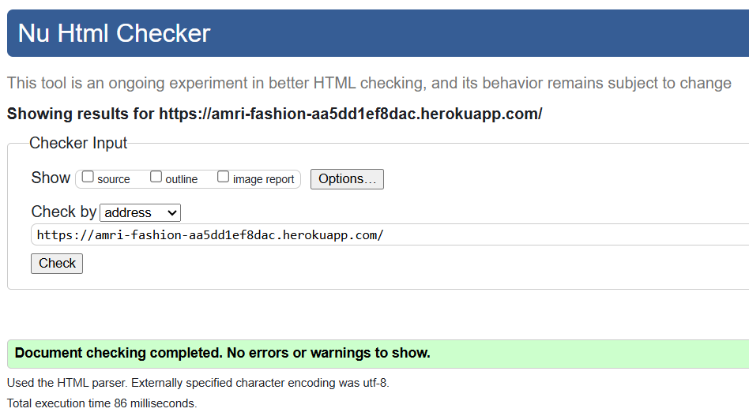
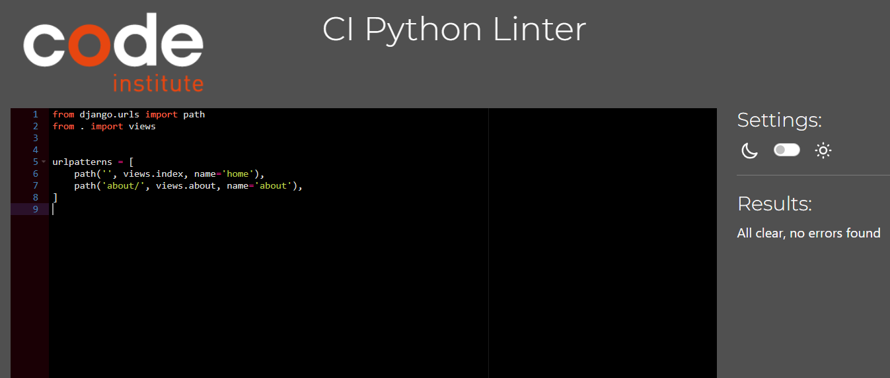

# Testing

Return back to the [README.md](README.md) file.

## Code Validation

### HTML

I have used the recommended [HTML W3C Validator](https://validator.w3.org) to validate all of my HTML files.

| Page | Screenshot | Notes |
| --- | --- | --- |
| about |  | Pass: No Errors |
| add-product |  | Pass: With info |
| bag |  | Pass: No Errors |
| checkout |  | Pass: No Errors |
| contact |  | Pass: No Errors |
| products |  | Pass: No Errors |
| edit-product |  | Pass: With info |
| faq |  | Pass: No Errors |
| home |  | Pass: No Errors |
| login |  | Pass: No Errors |
| product-detail |  | Pass: No Errors |
| profile |  | Pass: With info |
| register |  | Pass: No Errors |
| newletter |  | Pass: No Errors |

### CSS

I have used the recommended [CSS Jigsaw Validator](https://jigsaw.w3.org/css-validator) to validate all of my CSS files.

| File | Screenshot | Notes |
| --- | --- | --- |
| base.css |  | Pass: No Errors |
| checkout.css |  | Pass: No Errors |
| profile.css |  | Pass: No Errors |

### JavaScript

I have used the recommended [JShint Validator](https://jshint.com) to validate all of my JS files.

| File | Screenshot | Notes |
| --- | --- | --- |
| stripe_elements.js |  | With 3 warnings |
| countryfield.js |  | Pass: No Errors |

### Python

I have used the recommended [PEP8 CI Python Linter](https://pep8ci.herokuapp.com) to validate all of my Python files.

### Bag App
| File |  Screenshot | Notes |
| --- | --- | --- |
| contexts.py |  | Pass: No Errors |
| urls.py |  | Pass: No Errors |
| views.py |  | Pass: No Errors |

### Checkout App
| File | Screenshot | Notes |
| --- | --- | --- |
| forms.py |  | Pass: No Errors |
| models.py |  | Pass: No Errors |
| urls.py |  | Pass: No Errors |
| views.py |  | Pass: No Errors |
| webhook_handler.py |  | Pass: No Errors |
| webhooks.py |  | Pass: No Errors |

### Amri-fashion App
| File | Screenshot | Notes |
| --- | --- | --- |
| urls.py |  | Pass: No Errors |
| views.py |  | Pass: No Errors |
| custom_storage.py |  | Pass: No Errors |

### Contact App
| File | Screenshot | Notes |
| --- | --- | --- |
| models.py |  | Pass: No Errors |
| urls.py |  | Pass: No Errors |
| views.py |  | Pass: No Errors |

### Faq App
| File | Screenshot | Notes |
| --- | --- | --- |
| models.py |  | Pass: No Errors |
| urls.py |  | Pass: No Errors |
| views.py |  | Pass: No Errors |

### Home App
| File | Screenshot | Notes |
| --- | --- | --- |
| urls.py |  | Pass: No Errors |
| views.py |  | Pass: No Errors |

### Newsletter App
| File | Screenshot | Notes |
| --- | --- | --- |
| models.py |  | Pass: No Errors |
| urls.py |  | Pass: No Errors |
| views.py |  | Pass: No Errors |
| forms.py |  | Pass: No Errors |

### Products App
| File | Screenshot | Notes |
| --- | --- | --- |
| forms.py |  | Pass: No Errors |
| models.py |  | Pass: No Errors |
| urls.py |  | Pass: No Errors |
| views.py |  | Pass: No Errors |

### Profiles App
| File | Screenshot | Notes |
| --- | --- | --- |
| forms.py |  | Pass: No Errors |
| models.py |  | Pass: No Errors |
| urls.py |  | Pass: No Errors |
| views.py |  | Pass: No Errors |

## Lighthouse Audit

I've tested my deployed project using the Lighthouse Audit tool to check for any major issues.

On all pages, Lighthouse is flagging a warning 'Issues were logged in the Issues panel in Chrome Devtools'. This is caused by the built-in Stripe element, the image from home page, google font, fontawesom and CDN used by the site.

| Mobile | Desktop |
| --- | --- |
|  |  |

