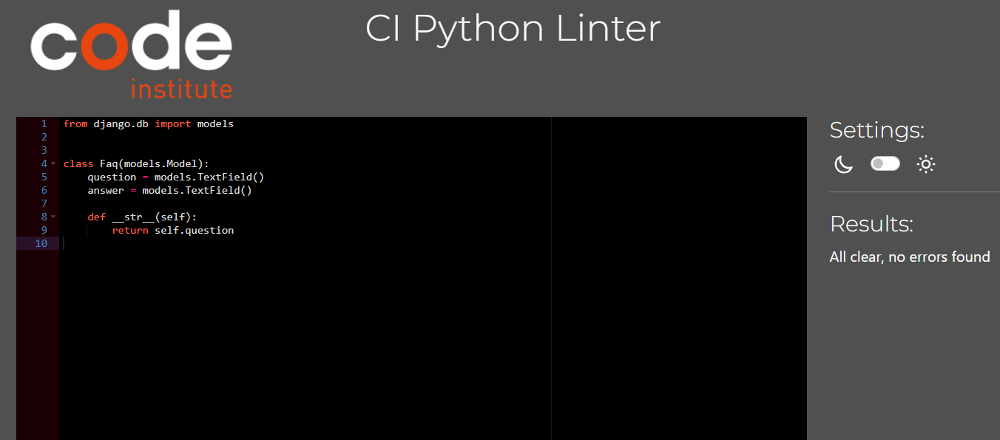
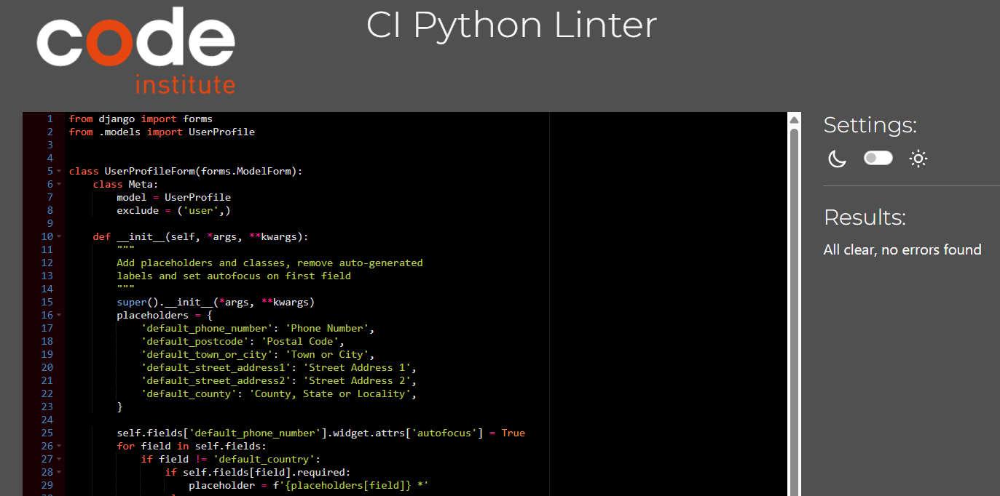
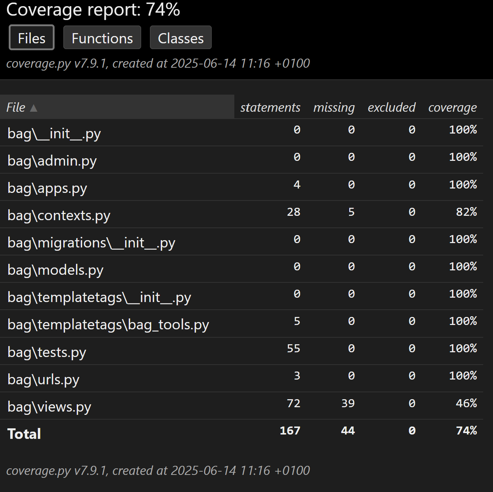

# Testing

Return back to the [README.md](README.md) file.

## Code Validation

### HTML

I have used the recommended [HTML W3C Validator](https://validator.w3.org) to validate all of my HTML files.

| Page | Screenshot | Notes |
| --- | --- | --- |
| about |  | Pass: No Errors |
| add-product |  | Pass: With info |
| bag |  | Pass: No Errors |
| checkout |  | Pass: No Errors |
| contact |  | Pass: No Errors |
| products |  | Pass: No Errors |
| edit-product |  | Pass: With info |
| faq |  | Pass: No Errors |
| home |  | Pass: No Errors |
| login |  | Pass: No Errors |
| product-detail |  | Pass: No Errors |
| profile |  | Pass: With info |
| register |  | Pass: No Errors |
| newletter |  | Pass: No Errors |

### CSS

I have used the recommended [CSS Jigsaw Validator](https://jigsaw.w3.org/css-validator) to validate all of my CSS files.

| File | Screenshot | Notes |
| --- | --- | --- |
| base.css |  | Pass: No Errors |
| checkout.css |  | Pass: No Errors |
| profile.css |  | Pass: No Errors |

### JavaScript

I have used the recommended [JShint Validator](https://jshint.com) to validate all of my JS files.

| File | Screenshot | Notes |
| --- | --- | --- |
| stripe_elements.js |  | With 3 warnings |
| countryfield.js |  | Pass: No Errors |

### Python

I have used the recommended [PEP8 CI Python Linter](https://pep8ci.herokuapp.com) to validate all of my Python files.

### Bag App
| File |  Screenshot | Notes |
| --- | --- | --- |
| contexts.py |  | Pass: No Errors |
| urls.py |  | Pass: No Errors |
| views.py |  | Pass: No Errors |

### Checkout App
| File | Screenshot | Notes |
| --- | --- | --- |
| forms.py |  | Pass: No Errors |
| models.py |  | Pass: No Errors |
| urls.py |  | Pass: No Errors |
| views.py |  | Pass: No Errors |
| webhook_handler.py |  | Pass: No Errors |
| webhooks.py |  | Pass: No Errors |

### Amri-fashion App
| File | Screenshot | Notes |
| --- | --- | --- |
| urls.py |  | Pass: No Errors |
| views.py |  | Pass: No Errors |
| custom_storage.py |  | Pass: No Errors |

### Contact App
| File | Screenshot | Notes |
| --- | --- | --- |
| models.py |  | Pass: No Errors |
| urls.py |  | Pass: No Errors |
| views.py |  | Pass: No Errors |

### Faq App
| File | Screenshot | Notes |
| --- | --- | --- |
| models.py |  | Pass: No Errors |
| urls.py |  | Pass: No Errors |
| views.py |  | Pass: No Errors |

### Home App
| File | Screenshot | Notes |
| --- | --- | --- |
| urls.py |  | Pass: No Errors |
| views.py |  | Pass: No Errors |

### Newsletter App
| File | Screenshot | Notes |
| --- | --- | --- |
| models.py |  | Pass: No Errors |
| urls.py |  | Pass: No Errors |
| views.py |  | Pass: No Errors |
| forms.py |  | Pass: No Errors |

### Products App
| File | Screenshot | Notes |
| --- | --- | --- |
| forms.py |  | Pass: No Errors |
| models.py |  | Pass: No Errors |
| urls.py |  | Pass: No Errors |
| views.py |  | Pass: No Errors |

### Profiles App
| File | Screenshot | Notes |
| --- | --- | --- |
| forms.py |  | Pass: No Errors |
| models.py |  | Pass: No Errors |
| urls.py |  | Pass: No Errors |
| views.py |  | Pass: No Errors |

## Lighthouse Audit

I've tested my deployed project using the Lighthouse Audit tool to check for any major issues.

On all pages, Lighthouse is flagging a warning 'Issues were logged in the Issues panel in Chrome Devtools'. This is caused by the built-in Stripe element, the image from home page, google font, fontawesom and CDN used by the site.

| Mobile | Desktop |
| --- | --- |
|  |  |

## Manual Testing
- Add Product: Tested by filling form and checking product list.
- Edit Product: Changed product name and other details and confirmed change.
- Delete Product: Deleted product and confirmed it’s removed.
- Add to Cart: Added product to bag, adjusted quantity, removed.
- Checkout: Submitted order and verified receipt message.

### Detailed Manual Testing

Defensive programming was manually tested with the below user acceptance testing:

| Page | User Action | Expected Result | Pass/Fail | Comments |
| --- | --- | --- | --- | --- |
| Nav links | | | | |
| | Click on site name in navbar | Redirection to Home page | Pass | |
| | Click on About Us link in navbar | Redirection to About page | Pass | |
| | Click on Faq link in navbar | Redirection to Faq page | Pass | |
| | Click on Contact link in navbar | Redirection to Contact page | Pass | |
| | Click on Search link in navbar | input to search on products page | Pass | |
| | Click on Register link in navbar | Redirection to Register page | Pass | |
| | Click on Login link in navbar | Redirection to Login page | Pass | |
| | Click on Bag link in navbar | Redirection to Bag page | Pass | |
| | Click on My Account - My Profile link in navbar | Redirection to User Profile page | Pass | |
| | Click on My Account - Logout link in navbar | Redirection to Logout page | Pass | |
| Footer | | | | |
| | Click on My Profile link in footer | Redirection to User Profile page | Pass | |
| | Click on Logout link in footer | Redirection to Logout page | Pass | |
| | Click on 'Subscribe Now' button in footer | Redir to Newsletter Subscription page | Pass | |
| Register | | | | |
| | Enter valid email address (twice) | Field will only accept email address format | Pass | |
| | Enter valid password (twice) | Field will only accept password format | Pass | |
| | Click on Sign Up button | Redirects user to blank Login page | Pass |
| | Click on Back To Login button | Redirects user to Login page | Pass |
| Log In | | | | |
| | Enter valid username/email | Field will accept username or email format | Pass | |
| | Enter valid password | Field will only accept password format | Pass | |
| | Click Login button | Log user in, Redirects to home page | Pass | |
| Log Out | | | | |
| | Click Logout button | Logs out user, Redirects user to home page | Pass |
| Profile | | | | |
| | Click on the Update Information button | Inputted information is saved | Pass | |
| | Click on Order History links | Redirects to user order confirmation | Pass | |
| Products | | | | |
| | Click on products image | Redirect to clicked Product details page | Pass | |
| | Click on product title | Redirect to clicked product details page | Pass | |
| | Click on sorting dropdown options | Sort products by selected criteria | Pass | |
| products - Admin Only| | | | |
| | Click on an edit button | Redirect to edit product page for that product | Pass | |
| | Click on a delete button | Trigger delete confirmation modal | Pass | |
| | Delete confirmation modal - 'yes, delete' button | Delete the product | Pass | |
| | Delete confirmation modal - 'no, go back' button | Close the modal | Pass | |
| Product Details | | | | |
| | Click on product image | Load full image | Pass | |
| | Click on 'Back To Our products' button | Redirect to products page | Pass | |
| | Click on 'Add To bag' button | Adds product to bag, bag message displayed | Pass | |
| Product Details - Admin Only | | | | |
| | Click on Edit button | Redirect to edit product page for that product | Pass | |
| | Click on Delete button | Trigger delete confirmation modal | Pass | |
| | Delete confirmation modal - 'yes, delete' button | Delete the product | Pass | |
| | Delete confirmation modal - 'no, go back' button | Close the modal | Pass | |
| FAQ | | | | |
| | Click on question | Dropdown with answer appears | Pass | |
| | Click on open question | Dropdown with answer disappears | Pass | |
| Contact | | | | |
| | Email input | Auto-fills if user is logged in | Pass | |
| | Email input | Required, accepts only email format | Pass | |
| | Name input | Required | Pass | |
| | Subject input | Required, user given a list of options | Pass | |
| | Message input | Required, Max characters = 1024 | Pass | |
| | Click on 'Send' button | Posts form if valid, redirects to contact success page | Pass | |
| bag | | | | |
| | Click on 'Remove This Item' link | Remove item from bag | Pass | |
| | Click on 'Back To products' button | Redirect to products page | Pass | |
| | Click on 'Secure Checkout' button | Redirect to Checkout page | Pass | |
| Checkout | | | | |
| | Full Name Input | Required | Pass | |
| | Email Input | Required, autofill if saved | Pass | |
| | Phone Number Input | Required, autofill if saved | Pass | |
| | Street Address 1 Input | Required, autofill if saved | Pass | |
| | Street Address 2 Input | Not required, autofill if saved | Pass | |
| | Town Or City Input | Required, autofill if saved | Pass | |
| | County Input | Not required, autofill if saved | Pass | |
| | Postal Code Input | Not required, autofill if saved | Pass | |
| | Country Input | Required, autofill if saved, select from options | Pass | |
| | Stripe Card Details | Required, validates on input | Pass | |
| | Hover over Address Details tooltip icon | Displays tooltip | Pass | |
| | Check 'save delivery info.' box | Saves information to user profile | Pass | |
| | Click product image in order summary | Redirect to the product details page | Pass | |
| | Click on 'Adjust bag' button | Redirect to bag page | Pass | |
| | Click on 'Complete Order' button | Complete Checkout with given information, redirect to order confirmation 

## Automated Testing

 - I have conducted a series of automated tests on my application.
 - I fully acknowledge and understand that, in a real-world scenario, an extensive set of additional tests would be more comprehensive.

### Python (Unit Testing)

- I have used Django's built-in unit testing framework to test the application functionality.
- In order to run the tests, I ran the following command in the terminal each time:

`python manage.py test name-of-app`

To create the coverage report, I would then run the following commands:

`coverage run --source=name-of-app manage.py test`

`coverage report`

To see the HTML version of the reports, and find out whether some pieces of code were missing, I ran the following commands:

`coverage html`

`python -m http.server`

Below are the results from the various apps on my application that I've tested:

| App | File | Coverage | Screenshot |
| --- | --- | --- | --- |
| bag | tests.py | 74% |  |
| checkout | tests.py | 70% |  |
| contact | tests.py | 96% |  |
| faq | tests.py | 98% |  |
| home | tests.py | 100% |  |
| newsletter | tests.py | 98% |  |
| products | tests.py | 93% |  |
| profiles | tests.py | 80% |  |

